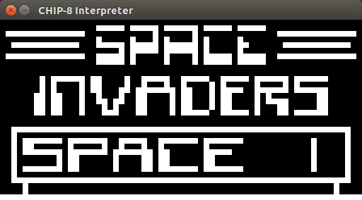
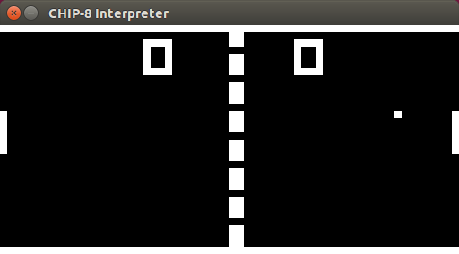

# CHIP-8 Interpreter

A CHIP-8 interpreter written for fun.

## Screenshots




## Build

The only library dependency is libsdl2. Run `make` to build the interpreter.

## Usage

```
chip8 [OPTIONS] ROMFILE

ROMFILE:
File path to a CHIP-8 ROM (required).

OPTIONS:
-h, --help                   Print this message.
-r, --instr-rate=RATE        Run (roughly) RATE instructions per second.
                             Default: 300, Min: 1.
-s, --scale-factor=FACTOR    Scale display resolution by FACTOR.
                             Default: 8, Min: 1, Max: 16.
```

For example, to run Space Invaders: `./chip8 SI.ch8`

## Contributing

Feel free to use or play around with this code. It is licensed under GPL v2.
Some idea's for improving the interpreter are:

  - Add support for SCHIP opcodes.
  - Add debugging functionality e.g. step through games one opcode at a time.
  - Add menu bar with various user friendly options:
    - Load ROM
    - Pause
    - Exit
    - Save and resume.
    - etc...

